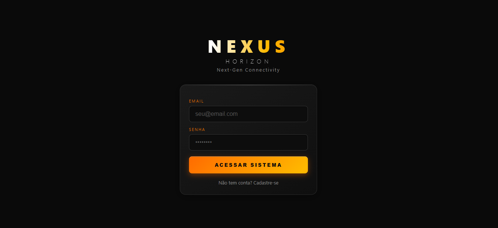
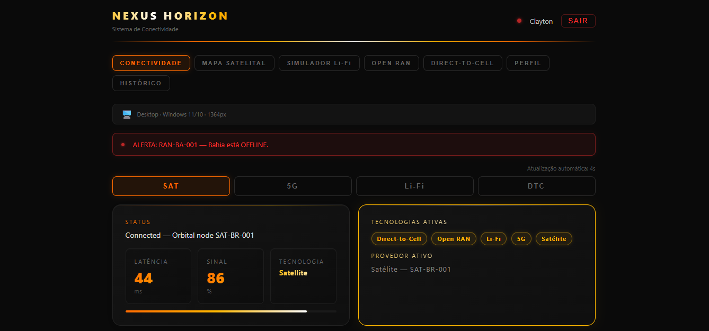
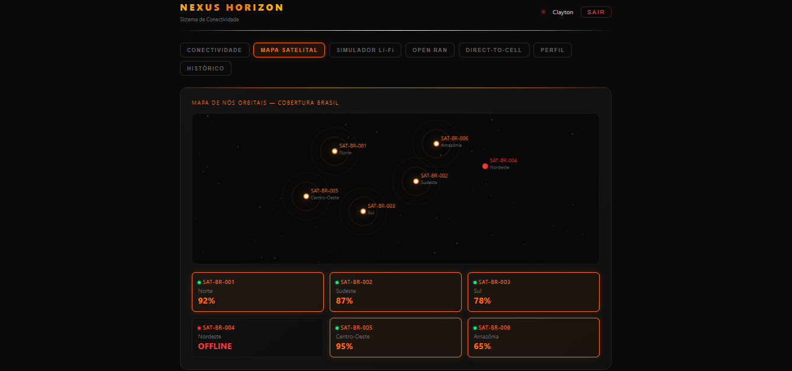
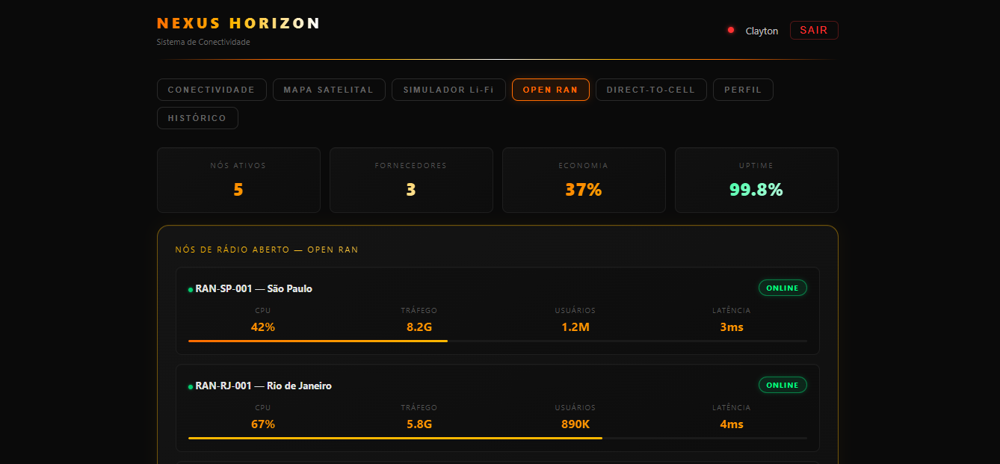

# ⚡ Nexus Horizon


> Next-Gen Connectivity System — Plataforma de monitoramento de conectividade com SAT, 5G, Li-Fi, Open RAN e Direct-to-Cell.

---

## 📱 Screenshots

| Login | Dashboard | Mapa Satelital | Open RAN |
|-------|-----------|----------------|----------|
|  |  |  |  |

---

## ✨ Features

- 🛰️ **Monitoramento SAT** — conexão via satélite em tempo real
- 📡 **5G e Li-Fi** — múltiplas tecnologias de conectividade
- 🗺️ **Mapa Satelital** — nós orbitais com cobertura do Brasil
- 💡 **Simulador Li-Fi** — transmissão de dados via luz com gráfico ao vivo
- 📶 **Open RAN** — monitoramento de nós de rádio aberto
- 📱 **Direct-to-Cell** — satélite direto para o celular
- 🔐 **Autenticação JWT** — login seguro com token
- 📊 **Dashboard completo** — métricas em tempo real
- 📱 **Responsivo** — funciona em mobile, tablet e desktop

---

## 🏗️ Architecture

```
Nexus-Horizon/
├── mobile/                  # App mobile (React Native)
│   └── src/
│       ├── screens/         # Telas do app
│       ├── services/        # Serviços e API
│       └── theme/           # Design system
├── server/                  # Backend Node.js
│   └── src/
│       ├── config/
│       │   └── web/         # Frontend HTML/CSS/JS
│       ├── controllers/     # Lógica de negócio
│       ├── core/            # ConnectivityProvider
│       ├── middlewares/     # Auth middleware
│       ├── repositories/    # Acesso ao Firebase
│       └── routes/          # Rotas da API
└── README.md
```

---

## 🚀 Tech Stack

| Tecnologia | Uso |
|-----------|-----|
| Node.js + Fastify | Backend API REST |
| TypeScript | Tipagem estática |
| Firebase Firestore | Banco de dados |
| JWT + AES-256 | Autenticação segura |
| HTML/CSS/JS | Frontend web |
| React Native + Expo | App mobile |

---

## ⚙️ Getting Started

```bash
# Clone o repositório
git clone https://github.com/claytonmarcelo/Nexus-Horizon.git

# Entre na pasta do servidor
cd Nexus-Horizon/server

# Instale as dependências
npm install

# Configure o .env
cp .env.example .env

# Compile e rode
npm run build
npm start
```

Acesse: **http://localhost:3333**

---

## 👨‍💻 Author

**Clayton Marcelo**
[](https://linkedin.com/in/clayton-marcelo-270602352)
[](https://github.com/claytonmarcelo)

---

## 📄 License

MIT License © 2026 Clayton Marcelo
