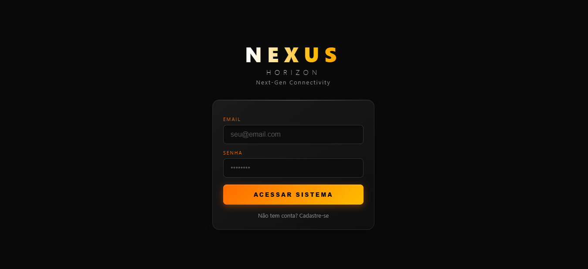
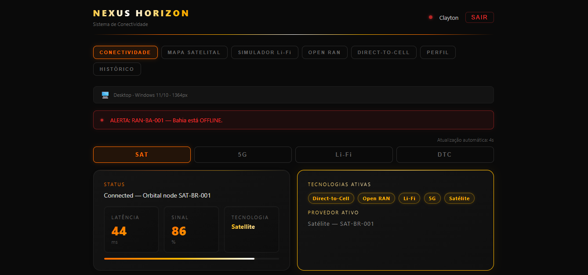
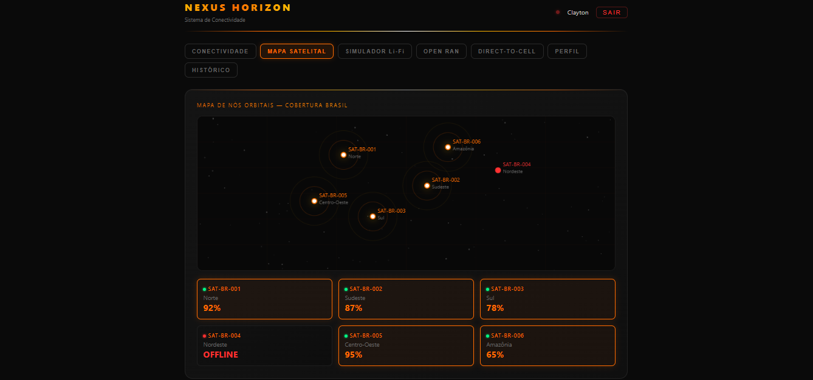
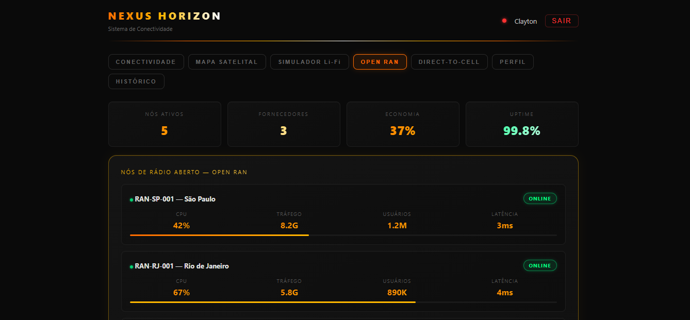

# ⚡ Nexus Horizon


> **Next-Gen Connectivity System** — Plataforma de monitoramento de conectividade com SAT, 5G, Li-Fi, Open RAN e Direct-to-Cell.

🌐 **Live Demo:** https://nexus-horizon.onrender.com/

---

## 📱 Screenshots

| Login | Dashboard | Mapa Satelital | Open RAN |
|-------|-----------|----------------|----------|
|  |  |  |  |

---

## ✨ Features

- 🛰️ **Monitoramento SAT** — conexão via satélite em tempo real
- 📡 **5G e Li-Fi** — múltiplas tecnologias de conectividade
- 🗺️ **Mapa Satelital** — nós orbitais com cobertura do Brasil
- 💡 **Simulador Li-Fi** — transmissão de dados via luz com gráfico ao vivo
- 📶 **Open RAN** — monitoramento de nós de rádio aberto
- 📱 **Direct-to-Cell** — satélite direto para o celular
- 🔐 **Autenticação JWT** — login seguro com token
- 📊 **Dashboard completo** — métricas em tempo real
- 📱 **Responsivo** — funciona em mobile, tablet e desktop

---

## 🏗️ Arquitetura

```text
Nexus-Horizon/
├── docs/
│   ├── index.html
│   ├── login.png
│   ├── dashboard.png
│   ├── map.png
│   └── oran.png
├── mobile/
│   └── src/
│       ├── screens/
│       ├── services/
│       └── theme/
├── server/
│   └── src/
│       ├── config/
│       ├── controllers/
│       ├── core/
│       ├── middlewares/
│       ├── repositories/
│       └── routes/
├── package.json
├── package-lock.json
└── README.md

---

## 🚀 Tech Stack

| Tecnologia                | Uso                    |
| ------------------------- | ---------------------- |
| Node.js + Fastify         | Backend API REST       |
| TypeScript                | Tipagem estática       |
| Firebase Firestore        | Banco de dados NoSQL   |
| JWT + bcryptjs            | Autenticação segura    |
| HTML5 + CSS3 + JavaScript | Frontend Web           |
| React Native + Expo       | Aplicativo Mobile      |
| Render                    | Deploy e Hospedagem    |
| GitHub Actions            | CI/CD                  |
| ESLint + Prettier         | Padronização de Código |

---

## 🌐 Deploy

| Serviço              | URL                                             |
| -------------------- | ----------------------------------------------- |
| 🖥️ Aplicação Online | https://nexus-horizon.onrender.com              |
| 🔥 Banco de Dados    | Firebase Firestore                              |
| 📦 Repositório       | https://github.com/claytonmarcelo/Nexus-Horizon |

---

## ⚙️ Getting Started

### Clone o projeto

```bash
git clone https://github.com/claytonmarcelo/Nexus-Horizon.git
```

### Entre na pasta do servidor

```bash
cd Nexus-Horizon/server
```

### Instale as dependências

```bash
npm install
```

### Configure as variáveis de ambiente

Crie o arquivo `.env`

```env
PORT=3333

JWT_SECRET=seu_secret
JWT_EXPIRES_IN=7d

FIREBASE_PROJECT_ID=seu_project_id
FIREBASE_CLIENT_EMAIL=seu_client_email
FIREBASE_PRIVATE_KEY=sua_private_key
```

### Executar em desenvolvimento

```bash
npm run dev
```

### Compilar

```bash
npm run build
```

### Produção

```bash
npm start
```

---

## 🔑 API Endpoints

| Método | Endpoint                     | Descrição           |
| ------ | ---------------------------- | ------------------- |
| POST   | /api/auth/register           | Cadastro de usuário |
| POST   | /api/auth/login              | Autenticação        |
| GET    | /api/auth/profile            | Perfil autenticado  |
| GET    | /api/connectivity/satellite  | Dados satelitais    |
| GET    | /api/connectivity/cellular   | Dados 5G            |
| GET    | /api/connectivity/lifi       | Dados Li-Fi         |
| GET    | /api/connectivity/directcell | Direct-to-Cell      |
| GET    | /health                      | Health Check        |

---

## 📁 Estrutura do Projeto

```text
Nexus-Horizon
├── docs
├── mobile
├── server
│   ├── src
│   ├── routes
│   ├── controllers
│   ├── repositories
│   ├── middlewares
│   └── config
├── package.json
└── README.md
```

---

## 👨‍💻 Desenvolvedor

**Clayton Marcelo**

Estudante de Análise e Desenvolvimento de Sistemas, com foco em:

* Desenvolvimento Mobile
* React Native
* TypeScript
* Firebase
* Node.js
* APIs REST
* Cloud Computing

GitHub:
https://github.com/claytonmarcelo

LinkedIn:
https://linkedin.com/in/clayton-marcelo-dev

---

## 📄 Licença

MIT License © 2026 Clayton Marcelo
